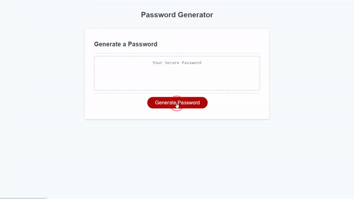

# Build-a-Password

## Description

Build-a-Password is site used to generate a secure password via alerts. In the age of roto-calls and phishing emails, security is very important. However, it is hard to come up with a password that is complex enough to keep you safe. Wouldn't it be nice to just have one generated for you and let your browser remember it. 

While I was developing the logic for the site, I familiarized myself with JavaScript. Building out functions, using recursion within said functions, using the prototype methods of arrays and Strings; through these concepts I was able to improve knwledge base so I can build more complex websites in the future. 

Below is an demo of the site:

## Credits

[Paul Grimshaw](https://stackoverflow.com/questions/16312528/check-if-an-array-contains-any-element-of-another-array-in-javascript) - Helped me to better understand the `some` method on arrays

## License

[MIT License](https://choosealicense.com/licenses/mit/).

Why not try to [generate a password](https://jpauldo.github.io/build-a-password/) for yourself. 
